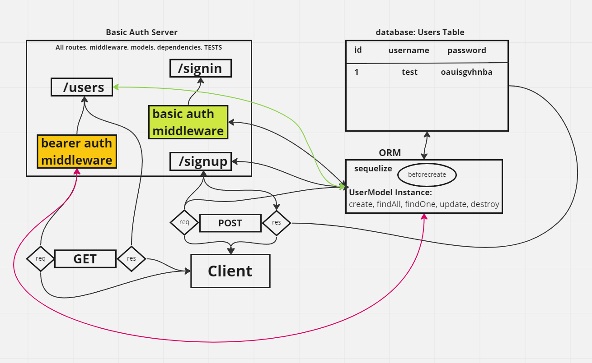

# LAB - Class 07

## Project: Bearer Auth

## Author: Steve Gant

## Problem Domain
Modularize the provided code

## Links and Resources
  - [GitHub Actions ci/cd](https://github.com/stevengant/bearer-auth/actions)
  - [back-end server url](https://stevegant-bearer-auth.onrender.com)

## Setup
.env requirements (where applicable)
DATABASE_URL=postgres://localhost:5432/lab07

How to initialize/run your application (where applicable)
  - e.g. npm start

How to use your library (where applicable)

Features / Routes
  - Feature One: Details of feature
  - GET : /person - specific route to hit

Tests
  - How do you run tests?
  - Any tests of note?
  - Describe any tests that you did not complete, skipped, etc

## UML
